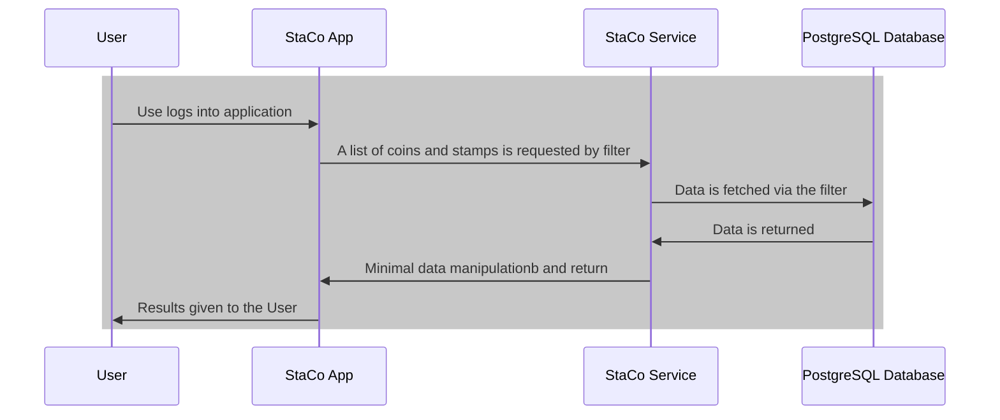

# StaCo - A Stamps and Coins application

---

---

## Technologies used

---

---

## How to run

There are three modes to run this application:

1. The application runs with a local and hard-coded BASIC authentication
2. The application uses OAuth in combination with GitHub. You can make your own app with it
3. The application runs with a local (and outdated) local OAuth token repository under PostgreSQL

### Run details

1. Start docker compose with the provided [build.sh](./build.sh).

If that doesn't work please try these steps:

```bash
docker-compose down
docker-compose up -d --build --remove-orphans
```

##### Run the backend

###### For local tests

```bash
cd stamps-and-coins-service
mvn clean install spring-boot:run
```

###### Using OAuth2 via GitHub

```bash
cd stamps-and-coins-service
mvn clean install spring-boot:run -Dspring-boot.run.profiles=prod -Dspring-boot.run.arguments="--staco.search.api.key=AAAAAAAAAAAAAAAAAAAAAAAAAAAAAAAAAAAAAAAA --staco.search.api.client.id=AAAAAAAAAAAAAAAAAAAA"
```

###### Using OAuth2 via Local

```bash
cd stamps-and-coins-service
mvn clean install spring-boot:run -Dspring-boot.run.profiles=locaprod
```

##### Run Front end

```bash
cd stamps-and-coins-web
npm start
```

##### Testing

[http://localhost:4200](http://localhost:4200/)

1.  In a non-oauth environment(default) use admin/admin as passwords.

2.  In a oauth-enabled environment enabled with github(prod) use your own github credentials

3.  In a local oauth-enabled environment with local tokens (locaprod) Login angular 2 page next...

##### Testing with OAuth

1. Main page

[http://localhost:4200](http://localhost:4200/)

2. Login with credentials admin/admin

3. Alternatively you can use OAuth2 token creation as described in this BASH list of commands:

```bash
curl -X POST -H "Content-Type: application/x-www-form-urlencoded" -d "grant_type=password&username=admin&password=admin&client_id=stamps-and-coins-client&client_secret=stamps-and-coins&scope=read&redirect_uri=http://localhost:8081/oauth" http://localhost:8081/oauth/token
curl -H "Authorization: Bearer TOKEN" http://localhost:4200/api/staco/all/
curl -H "Authorization: Bearer TOKEN" http://localhost:4200/api/staco/logout
```

## Sequence diagram



## Docker image

[](https://hub.docker.com/r/library/postgres)

- Remove all Docker images and builds

```bash
docker system prune --all
```

## Import database file

```bash
psql -p 5433 -h localhost -U postgres -d staco -f initial.sql 
```