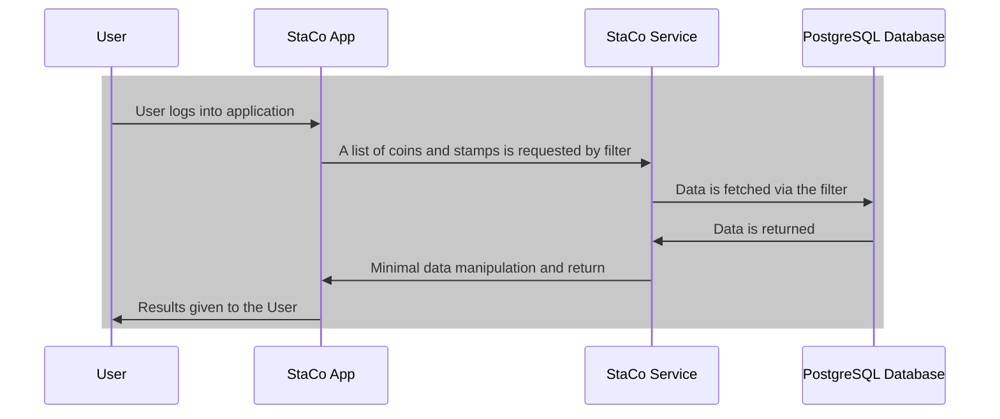
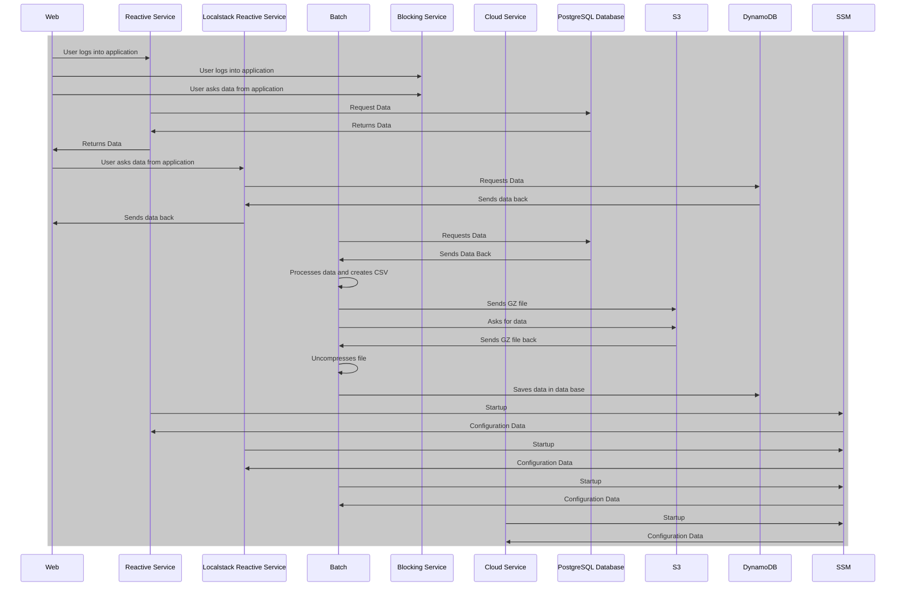

# StaCo - A Stamps and Coins application

---

[](https://twitter.com/intent/tweet?text=%20Checkout%20this%20%40github%20repo%20by%20%40joaofse%20%F0%9F%91%A8%F0%9F%8F%BD%E2%80%8D%F0%9F%92%BB%3A%20https%3A//github.com/jesperancinha/staco-app)
[](https://github.com/jesperancinha/staco-app)
[](#)

[](https://circleci.com/gh/jesperancinha/staco-app/tree/main)
[](https://github.com/jesperancinha/staco-app/actions/workflows/staco-app.yml)
[](https://github.com/jesperancinha/staco-app/actions/workflows/staco-app-e2e.yml)

[](https://www.codacy.com/gh/jesperancinha/staco-app/dashboard?utm_source=github.com&amp;utm_medium=referral&amp;utm_content=jesperancinha/staco-app&amp;utm_campaign=Badge_Grade)

[](https://www.codacy.com/gh/jesperancinha/staco-app/dashboard?utm_source=github.com&utm_medium=referral&utm_content=jesperancinha/staco-app&utm_campaign=Badge_Coverage)
[](https://codecov.io/gh/jesperancinha/staco-app)
[](https://coveralls.io/github/jesperancinha/staco-app?branch=main)

[](#)
[](#)
[](#)

---

## Technologies used

---

[](https://kotlinlang.org/)
[](https://spring.io/projects/spring-framework)
[](https://spring.io/projects/spring-boot)
[](https://spring.io/projects/spring-boot)
[](https://kotest.io/)
[](https://mockk.io/)
[](https://junit.org/junit5/docs/current/user-guide/)
[](https://www.docker.com/)
[](https://docs.docker.com/compose/)
[](https://www.testcontainers.org/)
[](https://swagger.io/)
[](https://www.cypress.io/)

---

## Introduction

This repo is the official support repo to my article on medium:

[](https://itnext.io/learning-aws-with-localstack-and-reactive-kotlin-a-stamps-and-coins-implementation-d10278f98587) [Learning AWS with Localstack and Reactive Kotlin - A stamps and coins implementation](https://itnext.io/learning-aws-with-localstack-and-reactive-kotlin-a-stamps-and-coins-implementation-d10278f98587)

<div align="center">
      <a title="Learning AWS with Localstack and Reactive Kotlin - A stamps and coins implementation" href="https://itnext.io/learning-aws-with-localstack-and-reactive-kotlin-a-stamps-and-coins-implementation-d10278f98587">
     
      </a>
</div>

#### Stable releases

-   [1.0.0](https://github.com/jesperancinha/staco-app/tree/1.0.0) - [58e5cd42080a7950423020a64fa08515299d406a](https://github.com/jesperancinha/staco-app/tree/1.0.0)

### Project Layout

##### Article related

-   [Stamps and Coins Demo](./stamps-and-coins-demo) - Module used to create Demo data. It sends Coin and Stamps images
  and it can generate the initial data
-   [Stamps and Coins Common](./stamps-and-coins-common) - Contains common libraries, namely, Data Transfer Objects,
  Domain model
-   [Stamps and Coins Common Cloud](./stamps-and-coins-common-cloud) - Contains common libraries for the cloud projects.
-   [Stamps and Coins Batch](./stamps-and-coins-batch) - Spring batch Quartz based Jobs. They dump the data from
  PostgreSQL to a file and ship it to S3. Another Job retrieves the data, unpacks it and sends it to DynamoDB.
-   [Stamps and Coins Service](./stamps-and-coins-service) - This is our starting point. It contains a Reactive
  Application which uses PostgreSQL using R2DBC repos on coroutines
-   [Stamps and Coins Local Stack Service](./stamps-and-coins-ls-service) - This application serves data in the same way
  as the above except that it connects to DynamoDB. All Localstack implementations are manual
-   [Stamps and Coins Web](./stamps-and-coins-web) - Front End Application to explore the different implementations.
  Pagination is implemented

##### External to article

-   [Stamps and Coins Cloud Server](./stamps-and-coins-cloud-service) - Uses automated configuration and tries to use
  Localstack as much as possible.
-   [Stamps and Coins Blocking Service](./stamps-and-coins-blocking-service) - The initial application that started this
  project back in April 2021. It is now a login authentication/authorization security exploration module, which contains
  implementations of BASIC Auth, OAUTH2 local Auth and OAUTH with GitHub.

---

## Setup environment

Be sure to have [Docker](https://www.docker.com/products/docker-desktop) installed

#### Install sdk7

Be sure to have [SDK-MAN](https://sdkman.io/) installed for this to work. You can choose another way. It is only
important to have JDK17 installed to have this working.

```shell
. ./sdk17.sh
```

#### K8s

```shell
. ./bash/k8s-setup.sh 
```

#### Docker

```shell
. ./bash/docker-setup.sh
```

---

## How to run

#### Running all automatically

```shell
make docker-clean-build-start
```

-   Endpoint:  [http://localhost:8080](http://localhost:8080)

> These containers take a while to start, so depending on your machine, the containers can start in anywhere between 10 seconds up to 5 minutes. Keep checking the logs with `docker logs` or `docker-compose logs`.

## Sequence diagram

To visualize these diagrams you may need
the [mermaid-diagrams](https://chrome.google.com/webstore/detail/mermaid-diagrams/phfcghedmopjadpojhmmaffjmfiakfil)
plugin installation.

To visualize them in Intellij, please install the [mermaid plugin](https://mermaid-js.github.io/mermaid/#/).


#### Old Sketch



#### Current Sequence Diagram



#### Walk through

<div align="center">
      <a title="Learning AWS with Localstack and Reactive Kotli DEMO- A stamps and coins implementation" href="https://www.youtube.com/watch?v=Xe8qjnfWJp4">
     
      </a>
</div>

#### Demo

To make it easy for you, I've created a few scripts to run this demo in a seamless way.

The most important script however, is the `demo-full-manual`.

If you run:

```shell
make demo-full-manual
```

Then just wait until it completes. The cypress pop-up will appear. You can then start the tests manually and see how this application works!

#### Swagger tests

You can make tests for this application using the Swagger UI at:

###### Stamps and Coins LocalStack Service

-   [Stamps and Coins LocalStack Service stamps-and-coins-ls-service 8080](http://localhost:8080/api/staco/ls/webjars/swagger-ui/index.html)
-   [Stamps and Coins LocalStack Service stamps-and-coins-ls-service 8082 (local)](http://localhost:8082/api/staco/ls/webjars/swagger-ui/index.html)

###### Stamps and Coins Reactive Service

-   [Stamps and Coins Reactive Service stamps-and-coins-ls-service 8080](http://localhost:8080/api/staco/service/webjars/swagger-ui/index.html)
-   [Stamps and Coins Reactive Service stamps-and-coins-ls-service 8081 (local)](http://localhost:8081/api/staco/service/webjars/swagger-ui/index.html)

## References

### Videos

-   [you need to learn AWS RIGHT NOW!! (Amazon Web Services)](https://www.youtube.com/watch?v=bgPuPSPZe2U)
-   [Top 50+ AWS Services Explained in 10 Minutes](https://www.youtube.com/watch?v=JIbIYCM48to)
-   [Spring Boot CRUD Example using AWS DynamoDB](https://www.youtube.com/watch?v=3ay92ZdCgwQ)
-   [Setting up AWS v2 with Spring Boot and Localstack](https://www.youtube.com/watch?v=FOzAdoxdnSc)
-   [Running AWS Services In A Laptop Using LocalStack](https://www.youtube.com/watch?v=8hi9P1ffaQk)


<div align="center">
      <a title="you need to learn AWS RIGHT NOW!! (Amazon Web Services)" href="https://www.youtube.com/watch?v=bgPuPSPZe2U">
     
      </a>
      <a title="Top 50+ AWS Services Explained in 10 Minutes" href="https://www.youtube.com/watch?v=JIbIYCM48to">
     
      </a>
      <a title="Spring Boot CRUD Example using AWS DynamoDB" href="https://www.youtube.com/watch?v=3ay92ZdCgwQ">
     
      </a>
      <a title="Setting up AWS v2 with Spring Boot and Localstack" href="https://www.youtube.com/watch?v=FOzAdoxdnSc">
     
      </a>
      <a title="Running AWS Services In A Laptop Using LocalStack" href="https://www.youtube.com/watch?v=8hi9P1ffaQk">
     
      </a>
</div>

### Online

-   [How to externalize Spring Boot Properties to an AWS System Manager Parameter Store](https://towardsaws.com/how-to-externalize-spring-boot-properties-to-an-aws-system-manager-parameter-store-2a945b1e856f)
-   [Representational state transfer](https://www.wikiwand.com/en/Representational_state_transfer)
-   [REST (REpresentational State Transfer)](https://searchapparchitecture.techtarget.com/definition/REST-REpresentational-State-Transfer)
-   [Wat is on-premise en wat is de cloud?](https://www.dynamicsonline.nl/erp-software/wat-is-on-premise-en-wat-is-de-cloud/)
-   [Who Coined 'Cloud Computing'?](https://www.technologyreview.com/2011/10/31/257406/who-coined-cloud-computing/)
-   [The history of cloud computing](https://www.scality.com/solved/the-history-of-cloud-computing/)
-   [My First 12 Years at Amazon.com](http://jeff-barr.com/2014/08/19/my-first-12-years-at-amazon-dot-com/)
-   [A Brief History of AWS](https://mediatemple.net/blog/cloud-hosting/brief-history-aws/)
-   [When to use (and when not to use) DynamoDB Filter Expressions](https://www.alexdebrie.com/posts/dynamodb-filter-expressions/)
-   [DynamoDB Scan vs Query - Everything You Need To Know](https://dynobase.dev/dynamodb-scan-vs-query/)
-   [What is "/var/folders"?](http://www.magnusviri.com/what-is-var-folders.html)
-   [From PostgreSQL to DynamoDB](https://www.dyspatch.io/blog/from-postgresql-to-dynamodb/)
-   [Amazon Web Services Systems Manager](https://docs.aws.amazon.com/cli/latest/reference/ssm/index.html#cli-aws-ssm)
-   [Don’t Be Intimidated — Learn How to Run AWS on Your Local Machine With LocalStack](https://betterprogramming.pub/dont-be-intimidated-learn-how-to-run-aws-on-your-local-machine-with-localstack-2f3448462254)
-   [Spring Boot Integration Tests With AWS Services Using LocalStack](https://rieckpil.de/test-spring-applications-using-aws-with-testcontainers-and-localstack/)
-   [Using LocalStack for Development Environments](https://www.maxcode.net/blog/using-localstack-for-development-environments/)
-   [Configuring Docker Swarm as Container Orchestrator on Windows](https://koukia.ca/configuring-docker-swarm-as-container-orchestrator-on-windows-1f89a2037dac)
-   [What is a Docker Swarm](https://www.sumologic.com/glossary/docker-swarm/)
-   [Kubernetes vs. Docker](https://azure.microsoft.com/en-us/topic/kubernetes-vs-docker/)
-   [Working with Queries in DynamoDB](https://docs.aws.amazon.com/amazondynamodb/latest/developerguide/Query.html)
-   [How to determine if Amazon DynamoDB is appropriate for your needs, and then plan your migration](https://aws.amazon.com/blogs/database/how-to-determine-if-amazon-dynamodb-is-appropriate-for-your-needs-and-then-plan-your-migration/)
-   [5 Use Cases for DynamoDB](https://rockset.com/blog/5-use-cases-for-dynamodb/)
-   [Local Stack Pro Features](https://localstack.cloud/features/#pro)
-   [LocalStack](https://github.com/localstack/localstack)
-   [LocalStack Cloud](https://localstack.cloud/)

## About me

<div align="center">

[](http://joaofilipesabinoesperancinha.nl)
[](https://www.youtube.com/@joaoesperancinha)
[](https://medium.com/@jofisaes)
[](https://www.buymeacoffee.com/jesperancinha)
[](https://twitter.com/joaofse)
[](https://masto.ai/@jesperancinha)
[](https://sessionize.com/joao-esperancinha)
[](https://www.instagram.com/joaofisaes)
[](https://jofisaes.tumblr.com)
[](https://open.spotify.com/user/jlnozkcomrxgsaip7yvffpqqm)
[](https://www.linkedin.com/in/joaoesperancinha/)
[](https://www.xing.com/profile/Joao_Esperancinha/cv)
[](https://news.ycombinator.com/user?id=jesperancinha)
[](https://github.com/jesperancinha)
[](https://bitbucket.org/jesperancinha)
[](https://gitlab.com/jesperancinha)
[](https://central.sonatype.com/search?smo=true&q=org.jesperancinha)
[](https://stackoverflow.com/users/3702839/joao-esperancinha)
[](https://www.credly.com/users/joao-esperancinha)
[](https://www.coursera.org/user/da3ff90299fa9297e283ee8e65364ffb)
[](https://hub.docker.com/u/jesperancinha)
[](https://www.reddit.com/user/jesperancinha/)
[](https://hackernoon.com/@jesperancinha)
[](https://dev.to/jofisaes)
[](https://www.codeproject.com/Members/jesperancinha)
[](https://www.freecodecamp.org/jofisaes)
[](https://www.hackerrank.com/jofisaes)
[](https://leetcode.com/jofisaes)
[](https://www.codewars.com/users/jesperancinha)
[](https://codepen.io/jesperancinha)
[](https://www.hackerearth.com/@jofisaes)
[](https://www.khanacademy.org/profile/jofisaes)
[](https://nl.pinterest.com/jesperancinha)
[](https://nl.quora.com/profile/Jo%C3%A3o-Esperancinha)
[](https://play.google.com/store/apps/developer?id=Joao+Filipe+Sabino+Esperancinha)
[](https://coderbyte.com/profile/jesperancinha)
[](https://www.infoq.com/profile/Joao-Esperancinha.2/)
[](https://www.credly.com/badges/87609d8e-27c5-45c9-9e42-60a5e9283280)
[](https://www.credly.com/badges/27a14e06-f591-4105-91ca-8c3215ef39a2)
[](https://www.credly.com/badges/762fa7a4-9cf4-417d-bd29-7e072d74cdb7)
[](https://www.credly.com/badges/ad1f4abe-3dfa-4a8c-b3c7-bae4669ad8ce)
[](https://www.credly.com/badges/8d27e38c-869d-4815-8df3-13762c642d64)
[](https://graphacademy.neo4j.com/certificates/c279afd7c3988bd727f8b3acb44b87f7504f940aac952495ff827dbfcac024fb.pdf)
[](https://cancanit.com/certified/1462/)
[](https://konghq.com/kong-champions)
[](https://github.com/JEsperancinhaOrg)
[](https://joaofilipesabinoesperancinha.nl/badges)
[](https://github.com/jesperancinha/project-signer/blob/master/project-signer-quality/Build.md)

</div>
